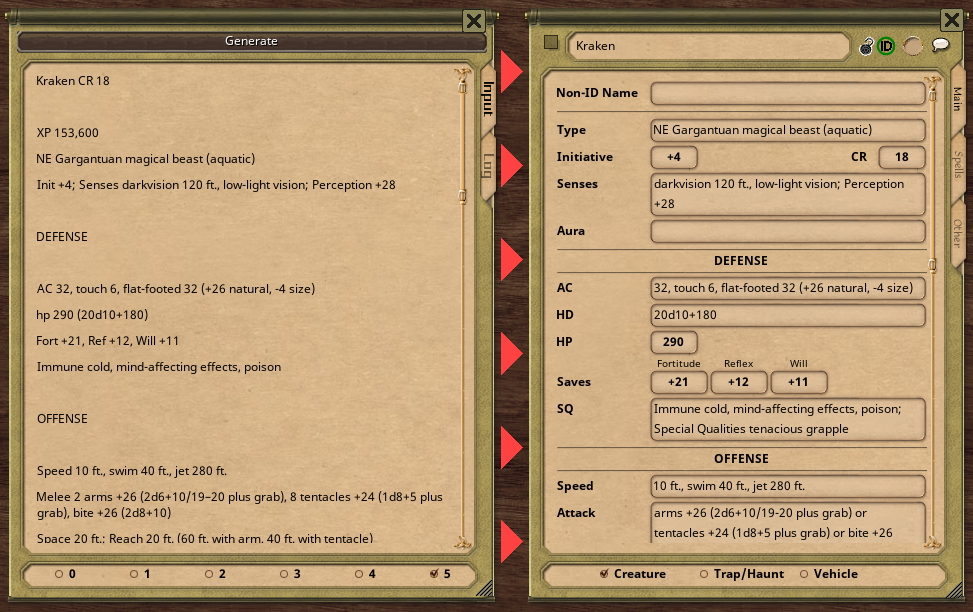

<!-- PROJECT LOGO -->
 

  

<h3 align="center">Creature Lab</h3>

  

    This is a <a href="https://www.fantasygrounds.com">Fantasy Grounds</a> extension that allows Pathfinder RPG statblocks to be copied and converted into functional NPCs.
     
     
    <a href="https://github.com/Lichtblitz/CreatureLab/issues">Report Bug</a>
    ·
    <a href="https://github.com/Lichtblitz/CreatureLab/issues">Request Feature</a>
  

<!-- ABOUT THE PROJECT -->
## About The Project

(<a href="#top">back to top</a>)

### Built With

* [Lua version 5.1](https://www.lua.org/)

(<a href="#top">back to top</a>)
